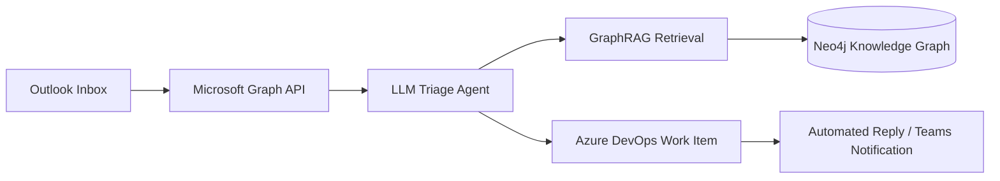
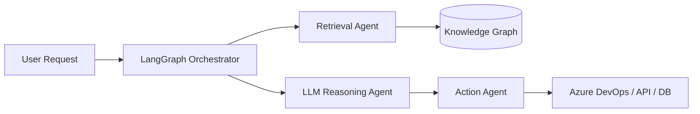

# 🚀 Yessine Fakhfakh — Agentic AI Engineer

<!-- Typing SVG Mirror (demolab is much more stable than herokuapp) -->

  

<!-- Contact Badges (Pure HTML to render correctly inside centered div) -->

> **Last updated:** 2026-06-30

---

## 🏅 Microsoft Credentials

- 🛡️ **Microsoft Certified** — Agentic AI Business Solutions Architect (AB‑100)
- 🔑 **Microsoft Applied Skills** — Get started with identities and access using Microsoft Entra

---

## 👋 About Me

I'm a **Software Engineer** building **enterprise-grade, autonomous AI systems** — the kind that sit inside real business workflows, not just demos.

My work centers on:
- 🤖 **Agentic AI & multi-agent orchestration** (LangGraph, LangChain)
- 🔍 **Enterprise RAG & GraphRAG pipelines**
- 🕸️ **Knowledge graphs** (Neo4j) for grounded, explainable AI
- 💼 **Microsoft Graph API**, Microsoft Entra, Azure DevOps automation
- ⚙️ **Workflow automation** (n8n, FastAPI) and AI architecture design

I enjoy turning messy, manual business processes into intelligent, autonomous systems — and I'm currently deepening my focus on production-grade agentic platforms across the Microsoft ecosystem.

📍 *Sfax, Tunisia* &nbsp;·&nbsp; 🎓 *National Engineering School of Sfax (ENIS)*

---

## 🧩 What I Build

- ⚡ **End-to-end AI systems**: data → model/agent → production
- 🧠 **Multi-agent AI systems** with RAG, LLM orchestration & knowledge graphs
- 🔀 **Hybrid agent workflows** (RAG + n8n + Neo4j)
- ☁️ **Microsoft-ecosystem automation** (Outlook, Graph API, Entra, Azure DevOps)
- 🎨 **Full-stack applications** to ship and support the above (React, Angular, .NET)

---

## 🏗️ Example System Architecture

#### Outlook Support Email to DevOps Pipeline

#### Multi-Agent Orchestrator Pipeline

---

## 📚 Repository Gallery

### 🤖 AI & Agentic Systems
- [**Outlook-TFS-automation**](https://github.com/yessine18/Outlook-TFS-automation) — .NET + AI pipeline analyzing Outlook support emails, performing RAG-based auto-resolve, and creating Azure DevOps work items · *C# · Python*
- [**Brain-tumor-Multi-Agent**](https://github.com/yessine18/Brain-tumor-Multi-Agent) — Multi-agent medical AI system: VGG19 classifier + Neo4j knowledge graph + Grad-CAM visualization · *Python 100%*
- [**Chatbot-RAG**](https://github.com/yessine18/Chatbot-RAG) — RAG chatbot with PostgreSQL vector search for university enrollment Q&A · *Jupyter Notebook · Python*
- [**AI-Receipt-Processing-Automation**](https://github.com/yessine18/AI-Receipt-Processing-Automation) — Self-hosted receipt OCR + LLM parsing, DB & bot integration · *Python 60.4% · JavaScript 39.6%*
- [**Motivation-Letter-email-Generator**](https://github.com/yessine18/Motivation-Letter-email-Generator) — AI-powered motivation letter generator using Gemini LLM · *Python* · [Live Demo](https://motivation-letter-email-generator.streamlit.app/)
- [**ML-Analyse-de-Churn**](https://github.com/yessine18/ML-Analyse-de-Churn) — Churn analysis experiments and dashboards · *HTML 44.5% · Python 31.7% · CSS 23.8%*

### 🌐 Full-Stack Web Development
- [**adaptive-backend**](https://github.com/yessine18/adaptive-backend) — Node.js backend service for adaptive web platform workflows · *JavaScript*
- [**yessine-portfolio**](https://github.com/yessine18/yessine-portfolio) — Personal portfolio site (live) · *HTML 48.3% · CSS 43.4% · JavaScript 8.3%* · [Live](https://yessine18.github.io/yessine-portfolio)
- [**TecWeek**](https://github.com/yessine18/TecWeek) — Event website for IEEE engineering congress · *TypeScript 84% · CSS 12.8%*
- [**Angular**](https://github.com/yessine18/Angular) — Angular full-stack application with backend integration · *TypeScript*
- [**Spring**](https://github.com/yessine18/Spring) — Java Spring microservices workspace (gateway, registry, and domain services) · *Java*
- [**PHP-project**](https://github.com/yessine18/PHP-project) — Web project in PHP · *PHP 57% · CSS 27.6% · Hack 12.7%*

### 🧪 Testing & Quality Assurance
- [**PlayWright-test**](https://github.com/yessine18/PlayWright-test) — Comprehensive Playwright E2E testing suite: smoke, integration, visual regression, a11y checks · *JavaScript*

### 🛰️ IoT & Environmental Monitoring
- [**TerraNova-2056**](https://github.com/yessine18/TerraNova-2056) — Satellite imagery & CanSat research for environmental monitoring with NDVI analysis

### 📖 Learning & Profile
- [**skills-introduction-to-github**](https://github.com/yessine18/skills-introduction-to-github) — GitHub learning exercises
- [**yessine18.github.io**](https://github.com/yessine18/yessine18.github.io) — GitHub Pages profile website repository
- [**yessine18**](https://github.com/yessine18/yessine18) — Profile README & portfolio hub (this repo)

---

## 🌟 Featured Projects

### 🧠 Brain-tumor-Multi-Agent
> A production-grade multi-agent AI system for medical imaging analysis.
>
> `Python` `TensorFlow` `Neo4j` `LangChain` `Groq`

- **Agent 1:** VGG19-based binary classifier with Grad-CAM explainability
- **Agent 2:** Neo4j knowledge graph integration for medical context mapping
- **Agent 3:** LLM-powered comprehensive report generation (Groq/Llama)
- [📂 View Repository](https://github.com/yessine18/Brain-tumor-Multi-Agent)

### 📧 Outlook-TFS-automation
> Enterprise automation stack that converts support emails into trackable DevOps workflows.
>
> `C#` `Python` `Microsoft Graph` `Azure DevOps` `pgvector`

- **Outlook mailbox polling** utilizing Microsoft Graph API
- **LLM extraction** for severity, intent, and routing context
- **RAG retrieval** from Microsoft documentation using PostgreSQL pgvector
- **Azure DevOps** work item creation + automated reply/notification flows
- [📂 View Repository](https://github.com/yessine18/Outlook-TFS-automation)

### 🧾 AI-Receipt-Processing-Automation
> Self-hosted pipeline for intelligent receipt processing.
>
> `Python` `Tesseract OCR` `PostgreSQL` `Telegram Bot`

- **Tesseract OCR preprocessing** with image enhancement
- **LLM parsing** (Gemini-compatible patterns) for structured data mapping
- **Local file storage** + PostgreSQL database integration
- **RESTful API** + Telegram bot integration
- [📂 View Repository](https://github.com/yessine18/AI-Receipt-Processing-Automation)

### 🌐 Adaptive Web Stack
> Backend and web engineering projects focused on scalable service architecture.
>
> `Node.js` `Spring` `React` `Angular`

- **Node.js backend** workflows for adaptive platform logic
- **Spring microservice architecture** experiments (gateway + service registry)
- **Frontend/backend integration patterns** across React, Angular, and Java services
- [📂 View Repository](https://github.com/yessine18/adaptive-backend)

### 🛰️ TerraNova 2056
> Satellite imagery analytics combined with CanSat IoT sensor data.
>
> `NDVI` `CanSat` `Environmental Monitoring`

- **NDVI & environmental indices** computation
- **CanSat data integration** for smart-city prototypes
- [📂 View Repository](https://github.com/yessine18/TerraNova-2056)

---

## 🛠️ Skills & Technologies

**AI & Agentic Systems**
 

**Microsoft Ecosystem**
 

**Databases & Knowledge**
 

**Automation**
 

**ML / Data**
 

**Languages**
 

**Frontend & Backend**
 

---

## 📊 GitHub Analytics

<!-- GitHub Stats & Top Languages -->

  

  

  

---

## 🏆 Highlights

- 🛡️ **Microsoft Certified** — Agentic AI Business Solutions Architect (AB‑100)
- 🔑 **Microsoft Applied Skills** — Identities & access with Microsoft Entra
- 🥇 **TSYP Best Video Award** — 2024
- 🏆 **Best IEEE Technical Chapter** — Tunisia Section — 2024
- 🤖 **Autonomous Robot Competition Winner** — 2024
- 👨‍💼 **Technical Team Lead** — IEEE Tunisian Engineering Congress Week 1.0 (Mar 2023 – Sep 2024)
- 📢 **Media & Content Roles** — PYANGO, IEEE ENIS, TSYP, ENIS Forum

---

## 📫 Connect

- **LinkedIn:** [Yessine Fakhfakh](https://www.linkedin.com/in/yessine-fakhfakh-470145298/)
- **Email:** yessine.fakhfakh@enis.tn
- **Portfolio:** [yessine18.github.io/yessine-portfolio](https://yessine18.github.io/yessine-portfolio)

---

*"Building intelligent systems that solve real business problems."*
— **Yessine Fakhfakh**

 

