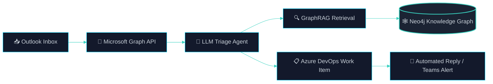
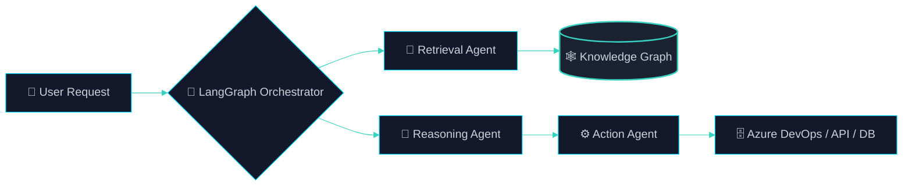

# Yessine Fakhfakh

$ whoami
Software Engineer — Sfax, Tunisia 🇹🇳 — ENIS

$ current_focus
Production-grade agentic platforms across the Microsoft ecosystem

Last updated · 2026‑06‑30

 

## 🏅 Credentials

[-0B1120?style=for-the-badge&logo=microsoft&logoColor=00D9FF)](#)

 

## 👋 About

I build **enterprise-grade, autonomous AI systems** — the kind that sit inside real business workflows, not just demos. My work centers on agentic AI and multi-agent orchestration, enterprise RAG and GraphRAG pipelines, knowledge graphs for grounded and explainable AI, and Microsoft-ecosystem automation across Graph API, Entra, and Azure DevOps. I enjoy turning messy, manual business processes into intelligent, autonomous systems, and I'm currently deepening my focus on production-grade agentic platforms across the Microsoft ecosystem.

| | |
|---|---|
| **Agentic Systems** | Multi-agent AI with RAG, LLM orchestration, and knowledge-graph grounding |
| **Hybrid Workflows** | RAG + n8n + Neo4j pipelines that bridge unstructured and structured data |
| **Microsoft Automation** | Outlook, Graph API, Entra, and Azure DevOps integration end to end |
| **Full-Stack Delivery** | React, Angular, and .NET applications that ship and support the above |

 

## 🏗️ How I Architect Agentic Systems

**Pattern A — Inbox-to-Resolution Agent** *(production implementation)*

**Pattern B — Generic Reasoning Loop** *(reusable orchestration shape)*

 

## 📚 Repository Gallery

<strong>🤖 AI & Agentic Systems</strong>

 

| Project | Description | Stack |
|---|---|---|
| [Outlook-TFS-automation](https://github.com/yessine18/Outlook-TFS-automation) | .NET + AI pipeline analyzing Outlook support emails, performing RAG-based auto-resolve, and creating Azure DevOps work items | C# · Python |
| [Brain-tumor-Multi-Agent](https://github.com/yessine18/Brain-tumor-Multi-Agent) | Multi-agent medical AI: VGG19 classifier + Neo4j knowledge graph + Grad-CAM visualization | Python |
| [Chatbot-RAG](https://github.com/yessine18/Chatbot-RAG) | RAG chatbot with PostgreSQL vector search for university enrollment Q&A | Jupyter · Python |
| [AI-Receipt-Processing-Automation](https://github.com/yessine18/AI-Receipt-Processing-Automation) | Self-hosted receipt OCR + LLM parsing, DB & bot integration | Python · JavaScript |
| [Motivation-Letter-email-Generator](https://github.com/yessine18/Motivation-Letter-email-Generator) | AI-powered motivation letter generator using Gemini LLM — [live demo](https://motivation-letter-email-generator.streamlit.app/) | Python |
| [ML-Analyse-de-Churn](https://github.com/yessine18/ML-Analyse-de-Churn) | Churn analysis experiments and dashboards | HTML · Python · CSS |

<strong>🌐 Full-Stack Web Development</strong>

 

| Project | Description | Stack |
|---|---|---|
| [adaptive-backend](https://github.com/yessine18/adaptive-backend) | Node.js backend service for adaptive web platform workflows | JavaScript |
| [yessine-portfolio](https://github.com/yessine18/yessine-portfolio) | Personal portfolio site — [live](https://yessine18.github.io/yessine-portfolio) | HTML · CSS · JavaScript |
| [TecWeek](https://github.com/yessine18/TecWeek) | Event website for the IEEE engineering congress | TypeScript · CSS |
| [Angular](https://github.com/yessine18/Angular) | Angular full-stack application with backend integration | TypeScript |
| [Spring](https://github.com/yessine18/Spring) | Java Spring microservices workspace (gateway, registry, domain services) | Java |
| [PHP-project](https://github.com/yessine18/PHP-project) | Web project in PHP | PHP · CSS |

<strong>🧪 Testing & Quality Assurance</strong>

 

| Project | Description | Stack |
|---|---|---|
| [PlayWright-test](https://github.com/yessine18/PlayWright-test) | Comprehensive Playwright E2E suite: smoke, integration, visual regression, a11y checks | JavaScript |

<strong>🛰️ IoT & Environmental Monitoring</strong>

 

| Project | Description | Stack |
|---|---|---|
| [TerraNova-2056](https://github.com/yessine18/TerraNova-2056) | Satellite imagery & CanSat research for environmental monitoring with NDVI analysis | — |

<strong>📖 Learning & Profile</strong>

 

| Project | Description |
|---|---|
| [skills-introduction-to-github](https://github.com/yessine18/skills-introduction-to-github) | GitHub learning exercises |
| [yessine18.github.io](https://github.com/yessine18/yessine18.github.io) | GitHub Pages profile website repository |
| [yessine18](https://github.com/yessine18/yessine18) | Profile README & portfolio hub (this repo) |

 

## 🌟 Featured Projects

### 🧠 Brain-tumor-Multi-Agent
> A production-grade multi-agent AI system for medical imaging analysis.

    

- **Agent 1** — VGG19-based binary classifier with Grad-CAM explainability
- **Agent 2** — Neo4j knowledge graph integration for medical context
- **Agent 3** — LLM-powered comprehensive report generation (Groq/Llama)

[View repository →](https://github.com/yessine18/Brain-tumor-Multi-Agent)

---

### 📧 Outlook-TFS-automation
> Enterprise automation stack that converts support emails into trackable DevOps workflows.

    

- Outlook mailbox polling with Microsoft Graph API
- LLM extraction for severity, intent, and routing context
- RAG retrieval from Microsoft documentation using PostgreSQL pgvector
- Azure DevOps issue creation with automated reply/notification flows

[View repository →](https://github.com/yessine18/Outlook-TFS-automation)

---

### 🧾 AI-Receipt-Processing-Automation
> Self-hosted pipeline for intelligent receipt processing.

   

- Tesseract OCR preprocessing with image enhancement
- LLM parsing using Gemini-compatible patterns
- Local file storage plus PostgreSQL database
- RESTful API and Telegram bot integration

[View repository →](https://github.com/yessine18/AI-Receipt-Processing-Automation)

---

### 🌐 Adaptive Web Stack
> Backend and web engineering projects focused on scalable service architecture.

   

- Node.js backend workflows for adaptive platform logic
- Spring microservice experiments (gateway + service registry)
- Frontend/backend integration patterns across React, Angular, and Java services

[View Node.js repo →](https://github.com/yessine18/adaptive-backend) · [View Spring repo →](https://github.com/yessine18/Spring)

---

### 🛰️ TerraNova 2056
> Satellite imagery analytics combined with IoT sensor data.

  

- NDVI and environmental-index computation
- CanSat data integration for smart-city prototypes

[View repository →](https://github.com/yessine18/TerraNova-2056)

 

## 🛠️ Skills & Technologies

| Category | Stack |
|---|---|
| **Agentic AI** |      |
| **Microsoft Ecosystem** |     |
| **Databases & Knowledge** |    |
| **Automation** |    |
| **ML / Data** |    |
| **Languages** |       |
| **Frontend & Backend** |     |

 

## 📊 GitHub Analytics

 

 

 

> [!NOTE]
> The cards above are served by free, community-run instances (`vercel.app` / `demolab.com`). They're the current, working domains — the originals pointed at `herokuapp.com` endpoints that went offline after Heroku discontinued free dynos. They're generally reliable but can occasionally rate-limit under heavy traffic; if a card ever goes blank, a refresh usually fixes it. For guaranteed uptime long-term, each project also supports generating a static SVG via a GitHub Actions workflow committed to this repo — worth doing later if you want zero dependency on third-party uptime.

 

## 🏆 Highlights & Achievements

- 🥇 **TSYP Best Video Award** — 2024
- 🏆 **Best IEEE Technical Chapter**, Tunisia Section — 2024
- 🤖 **Autonomous Robot Competition Winner** — 2024
- 👨‍💼 **Technical Team Lead**, IEEE Tunisian Engineering Congress Week 1.0 — Mar 2023 – Sep 2024
- 📢 **Media & Content Roles** — PYANGO, IEEE ENIS, TSYP, ENIS Forum

 

## 📫 Connect

*"Building intelligent systems that solve real business problems."*

