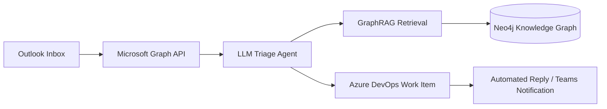
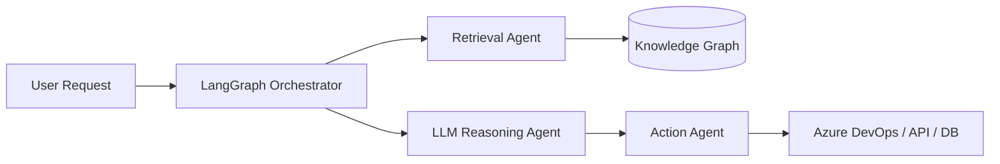

# 🚀 Yessine Fakhfakh — Agentic AI Engineer

<!-- Typing SVG Intro -->

 
<!-- Contact Badges -->

---
<table border="0" cellpadding="0" cellspacing="0" width="100%">
  <tr valign="top">
    <!-- Left Column: About & Focus -->
    <td width="55%">
      <h3>👋 About Me</h3>
      
I'm a <strong>Software Engineer</strong> building <strong>enterprise-grade, autonomous AI systems</strong> — the kind that sit inside real business workflows, not just demos.

      
I enjoy turning messy, manual business processes into intelligent, autonomous systems — and I'm currently deepening my focus on production-grade agentic platforms across the Microsoft ecosystem.

      
📍 Sfax, Tunisia &nbsp;|&nbsp; 🎓 National Engineering School of Sfax (ENIS)

       
      <h3>🏅 Microsoft Credentials</h3>
      <ul>
        <li>✔ <strong>Microsoft Certified</strong> — Agentic AI Business Solutions Architect (AB‑100)</li>
        <li>✔ <strong>Microsoft Applied Skills</strong> — Identities and access using Microsoft Entra</li>
      </ul>
    </td>
    <!-- Right Column: Quick Profile Stats Card -->
    <td width="45%" align="center">
      <h3>📊 GitHub Live Stats</h3>
      <!-- Primary GitHub Stats -->
      
      <!-- Language Stats -->
      
    </td>
  </tr>
</table>
---
## 🏗️ Showcase: System Architecture

<b>🔍 Click to view Multi-Agent & Automation Flowcharts (Mermaid)</b>

 
#### Outlook Support Email to DevOps Pipeline

#### Multi-Agent Orchestrator Pipeline

---
## 🛠️ Skills & Technologies
<table width="100%">
  <tr valign="top">
    <td width="33%">
      <strong>🤖 AI & Agentic Systems</strong> 
      • LangGraph / LangChain 
      • Enterprise RAG & GraphRAG 
      • Knowledge Graphs (Neo4j) 
      • LLM Orchestration & Agents
    </td>
    <td width="33%">
      <strong>⚙️ Microsoft Ecosystem</strong> 
      • Microsoft Graph API 
      • Microsoft Entra (Identities) 
      • Azure DevOps Automation 
      • .NET Core / C# / ASP.NET
    </td>
    <td width="33%">
      <strong>🌐 Full-Stack & Automation</strong> 
      • n8n / FastAPI / Python 
      • React / Angular / Spring Boot 
      • PostgreSQL (pgvector) / MongoDB 
      • Docker / E2E Testing (Playwright)
    </td>
  </tr>
</table>
---
## 🌟 Featured Projects
<table width="100%">
  <tr valign="top">
    <!-- Card 1 -->
    <td width="50%">
      <h4>🧠 <a href="https://github.com/yessine18/Brain-tumor-Multi-Agent">Brain-tumor-Multi-Agent</a></h4>
      
<em>Medical imaging multi-agent AI system.</em>

      

        
        
        
      

      <ul>
        <li><strong>VGG19 Classifier</strong> with Grad-CAM explainability maps.</li>
        <li><strong>Neo4j integration</strong> linking diagnoses to medical papers.</li>
        <li><strong>Llama-powered reports</strong> providing professional context.</li>
      </ul>
    </td>
    <!-- Card 2 -->
    <td width="50%">
      <h4>📧 <a href="https://github.com/yessine18/Outlook-TFS-automation">Outlook-TFS-automation</a></h4>
      
<em>Outlook support ticketing to DevOps automation stack.</em>

      

        
        
        
      

      <ul>
        <li><strong>Mailbox Polling</strong> utilizing Microsoft Graph API.</li>
        <li><strong>LLM Severity extraction</strong> & auto-resolution routing.</li>
        <li><strong>RAG context retrieval</strong> leveraging PostgreSQL vectors.</li>
      </ul>
    </td>
  </tr>
  <tr valign="top">
    <!-- Card 3 -->
    <td width="50%">
      <h4>🧾 <a href="https://github.com/yessine18/AI-Receipt-Processing-Automation">AI-Receipt-Processing</a></h4>
      
<em>OCR pipeline for intelligent receipt ingestion and parsing.</em>

      

        
        
        
      

      <ul>
        <li><strong>Tesseract OCR</strong> preprocessed with image enhancement.</li>
        <li><strong>Gemini LLM parsing</strong> mapping raw texts to structured databases.</li>
        <li><strong>Full Telegram bot integration</strong> for on-the-go receipts.</li>
      </ul>
    </td>
    <!-- Card 4 -->
    <td width="50%">
      <h4>🌐 <a href="https://github.com/yessine18/adaptive-backend">Adaptive Web Stack</a></h4>
      
<em>Scalable backend microservices and modern frontend architectures.</em>

      

        
        
        
      

      <ul>
        <li><strong>Node.js backend</strong> managing adaptive system workflows.</li>
        <li><strong>Spring registry gateway</strong> hosting scalable microservices.</li>
        <li><strong>Modern frontends</strong> built across React and Angular frameworks.</li>
      </ul>
    </td>
  </tr>
</table>

<b>📂 View More Repositories</b>

 
- [**yessine-portfolio**](https://github.com/yessine18/yessine-portfolio) — Personal portfolio website.
- [**PlayWright-test**](https://github.com/yessine18/PlayWright-test) — Comprehensive Playwright E2E testing suite.
- [**TecWeek**](https://github.com/yessine18/TecWeek) — Event website for IEEE engineering congress.
- [**TerraNova-2056**](https://github.com/yessine18/TerraNova-2056) — Satellite imagery CanSat environmental monitoring.
- [**Motivation-Letter-email-Generator**](https://github.com/yessine18/Motivation-Letter-email-Generator) — Streamlit Motivation letter generator.
- [**ML-Analyse-de-Churn**](https://github.com/yessine18/ML-Analyse-de-Churn) — Customer churn analysis dashboards.

---
## 🏆 Highlights & Leadership
- 🏅 **Microsoft Certified** — Agentic AI Business Solutions Architect (AB‑100)
- 🔑 **Microsoft Applied Skills** — Identities & access with Microsoft Entra
- 🥇 **TSYP Best Video Award** & **Best IEEE Technical Chapter** (Tunisia Section) — 2024
- 🤖 **Autonomous Robot Competition Winner** — 2024
- 👨‍💼 **Technical Team Lead** — IEEE Tunisian Engineering Congress Week (Mar 2023 – Sep 2024)
- 📢 **Media & Content Director** — PYANGO, IEEE ENIS, TSYP, ENIS Forum
---

<!-- Trophies Widget -->

  
<!-- Streak & Activity -->

  
*"Building intelligent systems that solve real business problems."*
— **Yessine Fakhfakh**
 

